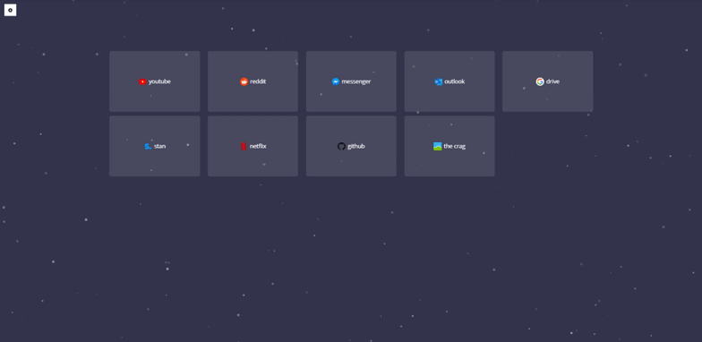

# Newtab

<p align="center">
  
</p>

A customisable replacement for chrome's new tab page.

<p align="center">
  
</p>

Built with:

- Webpack (4.x)
- Babel (7.x)
- Typescript (3.x)
- React (16.x)
- Redux (4.x)
- Reselect
- Sass

Development server using:

- webpack-dev-server

Style-checking:

- Prettier
- Tslint
- Stylelint & stylelint-config-sass-guidelines

Tested with:

- Jest
- Enzyme
- redux-mock-store

## Usage

### Download

[Available on the chrome web store](https://chrome.google.com/webstore/detail/new-new-tab-page/eonojphadknncejoaegdigoaonfpjbmo)

### Build

It is also possible to build and load the extension yourself before release.

```
// Clone repository
git clone https://github.com/Meebuhs/newtab

// Install dependencies
cd newtab
yarn

// Pack a production build
yarn build
```

Finally in chrome go to `chrome://extensions` and ensuring developer mode is enabled, load an unpacked extension and choose newtab/build.

Note that in order for the unsplash rotating background functionality to work you will need to create an [unsplash](unsplash.com/?utm_source=newtab&utm_medium=referral) account and get an access key. This key must be declared in `src/utils/api.ts` as follows:

```
export const apiKey = 'YOUR_KEY_HERE'
```

## Development

```
git clone https://github.com/Meebuhs/newtab
cd newtab
yarn
```

### Yarn commands

| Command         | Description                                     |
| --------------- | ----------------------------------------------- |
| `yarn build`    | Packages a production build of this extension.  |
| `yarn start`    | Starts a local development server on port 8080. |
| `yarn lint`     | Runs tslint/prettier and stylelint.             |
| `yarn prettier` | Perform in-place prettier reformat.             |
| `yarn test`     | Runs the test-suite using Jest.                 |
| `yarn dist`     | Compresses the current build for distribution.  |

## License

This project is released as open source under the [MIT License](https://opensource.org/licenses/MIT)
